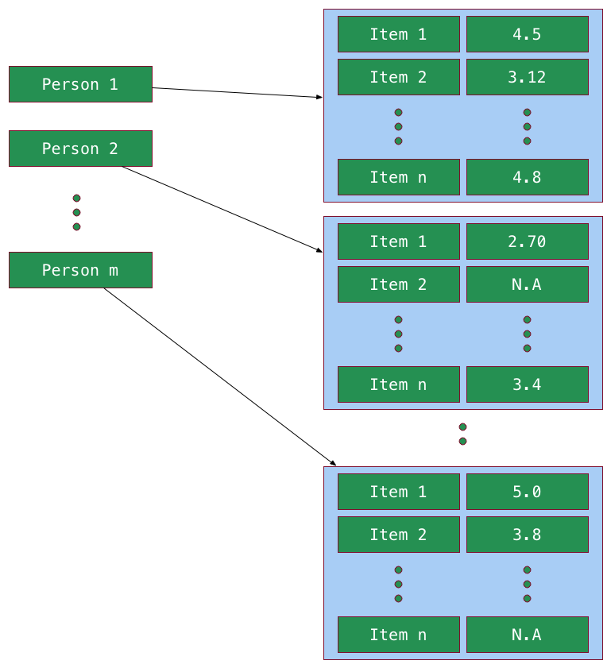
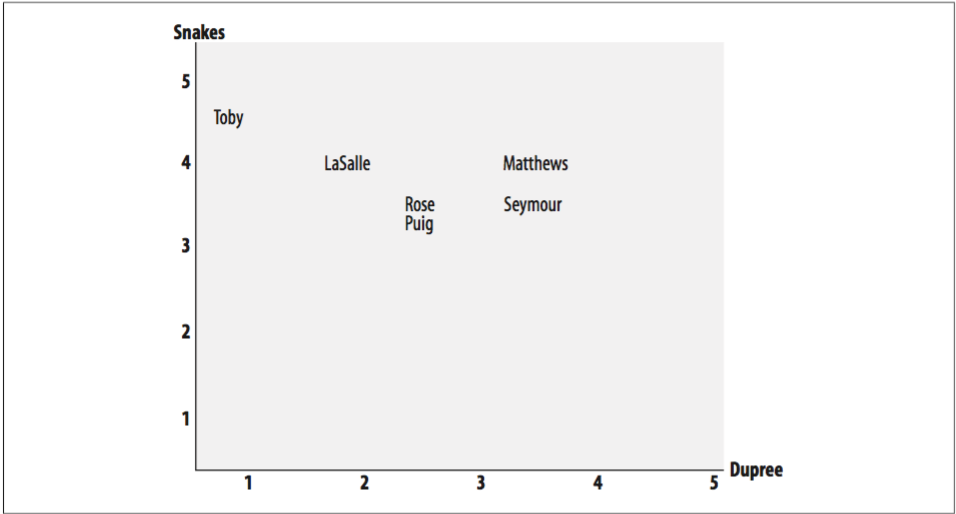
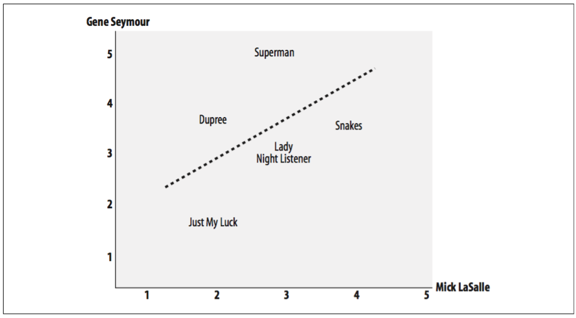
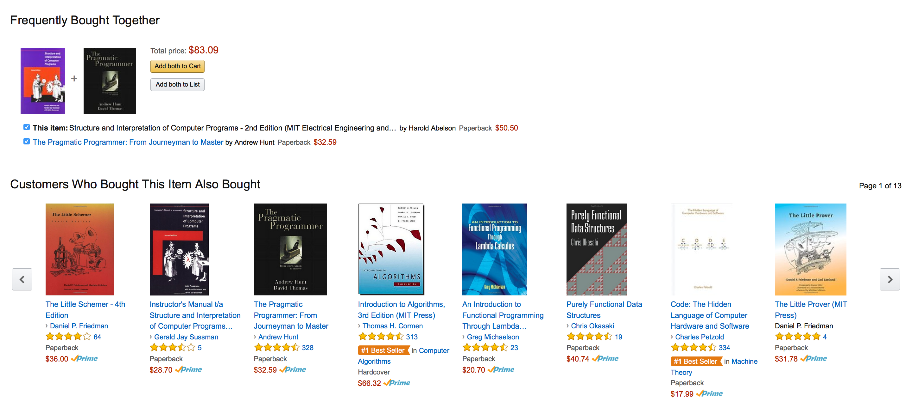
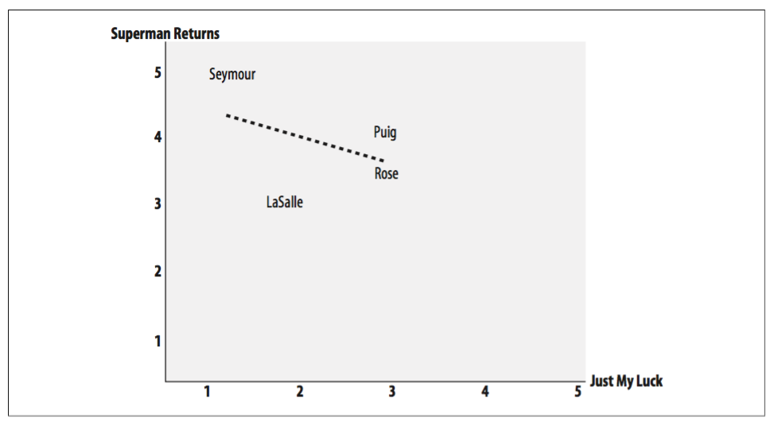
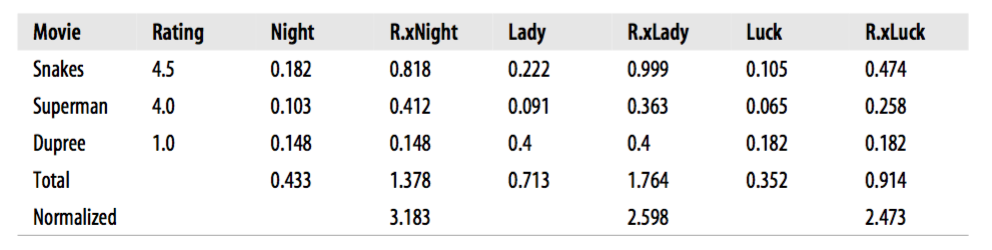

# Making recommendations

We can use data about the preferences of a group of people to make recommendations to other people. The main application of this, is recommender systems for product recommendation, web site suggestion, and finally, for music or movies discovery. An example of that, is Amazon, which tracks the purchasing and activity habits of all its shoppers, and when any user logs onto the page, it uses this information to suggest products the logged user migh like. Another interesting example, is that some online concert ticket agencies will look at the history of shows a user seen before and alert him to upcoming shows that migh be of interest.

## Collaborative filtering

A **collaborative filtering** algorithm usually works by searching a large group of people and finding a smaller set with tastes similar to yours. It looks at other things they like and combines them to create a ranked list of suggestions. There are several different ways of deciding which people are similar and combining their choices to make a list.

After collecting information on customer's taste, we need a way to determine how similar people are based in their tastes. One way to do that, is by comparing person to person to find out a similarity score. There are a few ways to do this, some of them are: Euclidean distance and Pearson correlation.



**Image:** In the image above, $$Item_i$$, represents a product or an item, and its calification $$C_i \in [A, B]$$ is given for every person, if the person has qualified such item. No matter how the qualifications are expressed, we need to convert them into numerical values.

A sample database illustrating that organization of people preferences on some product, is the following Python dictionary.

```python
prefs = {
    'Lisa Rose' : 
        {
            'Lady in the Water' : 2.5, 'Snakes on a Plane' : 3.5,
            'Just My Luck' : 3.0, 'Superman Returns' : 3.5, 
            'You, Me and Dupree' : 2.5, 'The Night Listener' : 3.0
        },

    'Gene Seymour' : 
        {
            'Lady in the Water' : 3.0, 'Snakes on a Plane' : 3.5,
            'Just My Luck' : 1.5, 'Superman Returns' : 5.0, 
            'The Night Listener' : 3.0, 'You, Me and Dupree' : 3.5
        },

    'Michael Phillips' : 
        {
            'Lady in the Water' : 2.5, 'Snakes on a Plane' : 3.0,
            'Superman Returns' : 3.5, 'The Night Listener' : 4.0
        },

    'Claudia Puig' : 
        {
            'Snakes on a Plane' : 3.5, 'Just My Luck' : 3.0,
            'The Night Listener' : 4.5, 'Superman Returns' : 4.0,
            'You, Me and Dupree' : 2.5
        },

    'Mick LaSalle' : 
        {
            'Lady in the Water' : 3.0, 'Snakes on a Plane' : 4.0,
            'Just My Luck' : 2.0, 'Superman Returns' : 3.0, 
            'The Night Listener' : 3.0, 'You, Me and Dupree' : 2.0
        },

    'Jack Matthews' : 
        {
            'Lady in the Water' : 3.0, 'Snakes on a Plane' : 4.0,
            'The Night Listener' : 3.0, 'Superman Returns' : 5.0, 
            'You, Me and Dupree' : 3.5
        },

    'Toby' : 
        {
            'Snakes on a Plane' : 4.5, 'You, Me and Dupree' : 1.0,
            'Superman Returns' : 4.0
        }
}
```

### Euclidean distance score

Taking the common items the people have ranked, we create a chart whose axes are the items, and the points are the people qualifications on those item (the ones displayed as axes of the chart).



**Image:** This figure shows the people charted in *preference space*. Toby has been plotted at 4.5 on the Snakes axis and at 1.0 on the Dupree axis. From this, we could infer that the closer two people are in the preference space, the more similar their preferences are.

$$d(Person_i,\ Person_j) = \sqrt{(X_1 - X_2)^2 +(Y_1 - Y2)^2}$$

$$d(Person_i,\ Person_j)$$, would be smaller for people with similar preferences. Since we want a metric that when is higher tells us that two people preferences are similar, we need to normalize this value.

$$\frac{1}{\left[ 1 + d(Person_i,\ Person_j) \right]}\ \in [0,\ 1]$$

An algorithm to get how similar two people are based on their product preferences, is:

```
ADT Person {
	name : String
}

prefs : Map<Person, Map<Movie, Real>> := getPreferences()

Algorithm Euclidean(person1 : Person, person2 : Person) {

	shared := prefs.get[person1].keys intersection prefs.get[person2].keys
	distance := summation over every i in shared of 
				(prefs.get[person1].get[i] - prefs.get[person2].get[i]) ^ 2
				
	if |shared| > 1 then {
		return (1 / (1 + distance))
	} else {
		return 0
	}	
			
}
```

That can be written easily in Python:

```python
def similarity_euclidean(person1, person2):
    common = [itm for itm in prefs[person1] \
        if itm in prefs[person2]]

    distance = [pow(prefs[person1][itm] - prefs[person2][itm], 2) \
        for itm in common]

    return 1 / (1 + sum(distance))
```

If one critic is inclined to give higher scores than the other, there can still be perfect correlation if the difference between their scores is consistent. The Euclidean distance score described earlier will say that two critics are dissimilar because one is consistently harsher than the other, even if their tastes are very similar. Depending on your particular application, this behavior may or may not be what you want.

### Pearson correlation coefficients

A slightly more sophisticated way to determine the similarity between people’s interests is to use a Pearson correlation coefficient. The correlation coefficient is a measure of how well two sets of data fit on a straight line. The formula for this is more complicated than the Euclidean distance score, but it tends to give better results in situations where the data isn’t well normalized, for example, if critics' movie rankings are routinely more harsh than average.



**Image:** To visualize this method, we can plot the ratings of two of the critics on a chart. Superman was rated 3 by Mick LaSalle and 5 by Gene Seymour, so it is placed at (3,5) on the chart. You can also see a straight line on the chart. This is called the best-fit line because it comes as close to all the items on the chart as possible. If the two critics had identi- cal ratings for every movie, this line would be diagonal and would touch every item in the chart, giving a perfect correlation score of 1.

One interesting aspect of using the Pearson score, which you can see in the figure, is that it corrects for *grade inflation*. In this figure, Jack Matthews tends to give higher scores than Lisa Rose, but the line still fits because they have relatively similar preferences. If one critic is inclined to give higher scores than the other, there can still be perfect correlation if the difference between their scores is consistent. The Euclidean distance score described earlier will say that two critics are dissimilar because one is consistently harsher than the other, even if their tastes are very similar. Depending on your particular application, this behavior may or may not be what you want.

The code for the Pearson correlation score first finds the items rated by both critics. It then calculates the sums and the sum of the squares of the ratings for the two crit- ics, and calculates the sum of the products of their ratings. Finally, it uses these results to calculate the Pearson correlation coefficient. Unlike the distance metric, this algorithm is not very intuitive, but it does tell us how much the variables change together divided by the product of how much they vary individually. The Pearson coefficient, is a number between -1 and 1 inclusive.

```
ADT Person {
	name : String
}

prefs : Map<Person, Map<Movie, Real>> := getPreferences()

Algorithm Pearson(person1 : Person, person2 : Person) {

	shared := prefs.get[person1].keys intersection prefs.get[person2].keys
	
	s1 := summation over every i in shared of 
		prefs.get[person1][i]
	s1 := summation over every i in shared of 
		prefs.get[person2][i]
		
	ss1 := summation over every i in shared of 
		prefs.get[person1][i] * prefs.get[person1][i]
	ss2 := summation over every i in shared of 
		prefs.get[person2][i] * prefs.get[person2][i]
		
	ps := summation over every m in shared of 
		[prefs[person1][m] * prefs[person2][m]
				
	num = ps - ((s1 * s2) / n)
    den = math.sqrt((ss1 - s1 ^ 2 / n) * (ss2 - s2 ^ 2 / n))
    
    return num / den if den != 0 else 0		
}
```

This can easily be translated into Python:

```python
def similarity_pearson(person1, person2):
    common = [itm for itm in prefs[person1] \
        if itm in prefs[person2]]

    n = len(common)

    s1 = sum([prefs[person1][m] for m in common])
    s2 = sum([prefs[person2][m] for m in common])

    ss1 = sum([pow(prefs[person1][m], 2) for m in common])
    ss2 = sum([pow(prefs[person2][m], 2) for m in common])

    ps = sum([prefs[person1][m] * prefs[person2][m] for m in common])

    num = ps - ((s1 * s2) / n)
    den = math.sqrt((ss1 - pow(s1, 2) / n) * (ss2 - pow(s2, 2) / n))

    return num / den if den != 0 else 0
```

### Which Similarity Metric Should You Use?

There are actually many more ways to measure similarity between two sets of data. The best one to use will depend on your application, and it is worth trying Pearson, Euclidean distance, or others to see which you think gives better results. There are many other functions such as the *Jaccard coefficient* or *Manhattan distance* that are used as similarity functions. As long as an algorithms, has the same signature, and return a float where a higher value means more similar, it could be used as a metric for similarity.

## Recommending items

Now that we have a way to measure how similar two people are, we can create a function that scores everyone against a given person and finds the closests matches. For that, we need to score the items by producting a weighted score that ranks the critics. A valid approach for that, is to take the votes of all the other critics and multiply how similar they are to me by the score they gave each item (in the example, each movie). You could just use the totals to calculate the rankings, but then a movie reviewed by more people would have a big advantage. To correct for this, you need to divide by the sum of all the similarities for critics that reviewed that movie.

Not only do you get a ranked list of items, but you also get a guess at what my rating for each item would be. You’ll find that the results are only affected very slightly by the choice of similarity metric.

```python
def top_matches(prefs, person, bound, similarity):
    scores = [(similarity(prefs,person,other),other) \
                for other in prefs if other != person]

    scores.sort()
    scores.reverse()
    return scores[0:bound]

def recommend(prefs, person, bound, similarity):
    scores = top_matches(prefs, person, bound, similarity)
    recommendations = {}

    for sim, other in scores:
        ranked = prefs[other]

        for movie in ranked:           
            if movie not in prefs[person]:
                weighted_score = sim * ranked[movie]

                if movie in recommendations:
                    s, weighted_scores = recommendations[movie]
                    recommendations[movie] = (s + sim, weighted_scores \
                    	+ [weighted_score])
                else:
                    recommendations[movie] = (sim, [weighted_score])

    for r in recommendations:
        sim, data = recommendations[r]
        recommendations[r] = sum(data) / sim

    return recommendations
```

An example:

```python
>>> recommend("Toby", 5, similarity_pearson)

{
	'Lady in the Water': 3.0022347306071264, 
	'Just My Luck': 2.5309807037655645, 
	'The Night Listener': 3.119201586785552
}

>>> recommend("Toby", 5, similarity_euclidean)

{
	'Lady in the Water': 2.7561242939959363, 
	'Just My Luck': 2.461988486074374, 
	'The Night Listener': 3.5002478401415877
}

```

The data structure used troughout the examples, are often hard to get, or involve more computations than alternative forms. One way to deal with that, is to find similar product items, that is, given a product item, we woul like to find some products that are similar to the given one. You may have encountered this on shopping web sites, particularly when the site hasn’t col- lected a lot of information about you, for example, Amazon related books in almost every book that Amazon provides.



In this case, we can determine similarity by looking at who liked a particular item and seeing the other things they liked. This is actually the same method we used earlier to determine similarity between people, you just need to swap the people and the items. So you can use the same methods you wrote earlier if you transform the dictionary from:

```python
{
	'Lisa Rose' : 
		{
			'Lady in the Water' : 2.5, 
			'Snakes on a Plane' : 3.5
		},
    'Gene Seymour' : 
    	{
    		'Lady in the Water' : 3.0, 
    		'Snakes on a Plane' : 3.5
    	}
}
```

to

```python
{
	'Lady in the Water' : 
		{
			'Lisa Rose' : 2.5,
			'Gene Seymour' : 3.0
		},
	'Snakes on a Plane' :
		{
			'Lisa Rose' : 3.5,
			'Gene Seymour' : 3.5
		}
}
```

A Python function, to automate this transformation is:

```python
def transform_prefs(prefs):
    result = {}

    for person in prefs:
        for item in prefs[person]:
            result.setdefault(item, {})
            result[item][person] = prefs[person][item]

    return result

>>> movies = transform_prefs(prefs)   
>>> top_matches(movies,  'Lady in the Water', 3, similarity_pearson)

[	
	(0.7637626158259785, 'Snakes on a Plane'), 
	(0.4879500364742689, 'Superman Returns'), 
	(0.3333333333333333, 'You, Me and Dupree')
]

>>> top_matches(movies,  'Superman Returns', 5, similarity_pearson)

[
	(0.6579516949597695, 'You, Me and Dupree'), 
	(0.4879500364742689, 'Lady in the Water'), 
	(0.11180339887498941, 'Snakes on a Plane'), 
	(-0.1798471947990544, 'The Night Listener'), 
	(-0.42289003161103106, 'Just My Luck')
]
```

Notice that in this example there are actually some negative correlation scores, which indicate that those who like *Superman Returns* tend to dislike *Just My Luck*.



To twist things around even more, we can get recommended critics for a movie. Maybe we can use that program to choose who to invite to a premiere.

```python
>>> recommend(movies, 'Just My Luck', 5, similarity_pearson)

{
	'Toby': 2.9609998607242685, 
	'Jack Matthews': 3.871694896131647, 
	'Michael Phillips': 2.2872022472681763
}
```
It’s not always clear that flipping people and items will lead to useful results, but in many cases it will allow you to make interesting comparisons. An online retailer might collect purchase histories for the purpose of recommending products to individuals. Reversing the products with the people, as you’ve done here, would allow them to search for people who might buy certain products. This might be very useful in planning a marketing effort for a big clearance of certain items. Another potential use is making sure that new links on a link-recommendation site are seen by the people who are most likely to enjoy them.

## Item-based filtering

The way the recommendation engine has been implemented so far requires the use of all the rankings from every user in order to create a dataset. This will probably work well for a few thousand people or items, but a very large site like Amazon has millions of customers and products, comparing a user with every other user and then comparing every product each user has rated can be very slow. Also, a site that sells millions of products may have very little overlap between people, which can make it difficult to decide which people are similar.

The technique we have used thus far is called *user-based collaborative filtering*. An alternative is known as *item-based collaborative filtering*. In cases with very large datasets, item-based collaborative filtering can give better results, and it allows many of the calculations to be performed in advance so that a user needing recommendations can get them more quickly.

The procedure for *item-based filtering* draws a lot on what we have already discussed. The general technique is to precompute the most similar items for each item. Then, when you wish to make recommendations to a user, you look at his top-rated items and create a weighted list of the items most similar to those. **The important difference here is that, although the first step requires you to examine all the data, comparisons between items will not change as often as comparisons between users**. This means we do not have to continuously calculate each item’s most similar items, you can do it at low-traffic times or on a computer separate from your main application.

To compare items, the first thing we'll need to do is write a function to build the complete dataset of similar items. Again, this does not have to be done every time a recommendation is needed, instead, we build the dataset once and reuse it each time we need it.

```python
def get_similar_items(prefs, n = 10):
    result = {}
    item_prefs = transform_prefs(prefs)
    c = 0

    for item in item_prefs:

        c += 1
        if c % 100 == 0: 
            print "%d / %d" % (c, len(item_prefs))

        scores = top_matches(item_prefs, item, n, similarity_euclidean)
        result[item] = scores

    return result
    
>>> get_similar_items(prefs)

{ 
	'Lady in the Water': 
		[
			(0.4, 'You, Me and Dupree'), 
			(0.2857142857142857, 'The Night Listener'), 
			(0.2222222222222222, 'Snakes on a Plane'), 
			(0.2222222222222222, 'Just My Luck'), 
			(0.09090909090909091, 'Superman Returns')
		], 
	'Snakes on a Plane': 
		[
			(0.2222222222222222, 'Lady in the Water'), 
			(0.18181818181818182, 'The Night Listener'), 
			(0.16666666666666666, 'Superman Returns'), 
			(0.10526315789473684, 'Just My Luck'), 
			(0.05128205128205128, 'You, Me and Dupree')
		], 
	'Just My Luck': 
		[
			(0.2222222222222222, 'Lady in the Water'), 
			(0.18181818181818182, 'You, Me and Dupree'), 
			(0.15384615384615385, 'The Night Listener'), 
			(0.10526315789473684, 'Snakes on a Plane'), 
			(0.06451612903225806, 'Superman Returns')
		], 
	'Superman Returns': 
		[
			(0.16666666666666666, 'Snakes on a Plane'), 
			(0.10256410256410256, 'The Night Listener'), 
			(0.09090909090909091, 'Lady in the Water'), 
			(0.06451612903225806, 'Just My Luck'), 
			(0.05333333333333334, 'You, Me and Dupree')
		], 
	'You, Me and Dupree': 
		[
			(0.4, 'Lady in the Water'), 
			(0.18181818181818182, 'Just My Luck'), 
			(0.14814814814814814, 'The Night Listener'), 
			(0.05333333333333334, 'Superman Returns'), 
			(0.05128205128205128, 'Snakes on a Plane')
		], 
	'The Night Listener': 
		[
			(0.2857142857142857, 'Lady in the Water'), 
			(0.18181818181818182, 'Snakes on a Plane'), 
			(0.15384615384615385, 'Just My Luck'), 
			(0.14814814814814814, 'You, Me and Dupree'), 
			(0.10256410256410256, 'Superman Returns')
		] 
}
```

This function only has to be run frequently enough to keep the item similarities up to date. We will need to do this more often early on when the user base and number of ratings is small, but as the user base grows, the similarity scores between items will usually become more stable.

Now we’re ready to give recommendations using the item similarity dictionary without going through the whole dataset. We’re going to get all the items that the user has ranked, find the similar items, and weight them according to how similar they are. The items dictionary can easily be used to get the similarities. Now, we proceed with an example on how to find the recommendations for our user Toby.

```
'Toby' : 
        {
            'Snakes on a Plane' : 4.5, 'You, Me and Dupree' : 1.0,
            'Superman Returns' : 4.0
        }
        
 TobyMovies = [('Snakes on a Plane', 4.5), ('You, Me and Dupree', 1.0),
            		('Superman Returns', 4.0)]
            		
 for movie in TobyMovies do {
 	for rating, movie in get_similar_items(prefs) do {
 		if movie in TobyMovies then
 			continue
 		else {
 			...
 		}
 	}
 }

```



**Table:** For every movie that Toby has not ranked yet, we compare it against each Toby's movie from the index given by the functions, once that, we get a weighted rating based on that, and then we normalized as before. 

Each row has a movie that Toby have already seen, along with Toby's personal rating for it. For every movie that Toby haven’t seen, there’s a column that shows how similar it is to the movies that Toby have seen, for example, the similarity score between *Superman* and *The Night Listener* is 0.103. The columns starting with R.x show my rating of the movie multiplied by the similarity, since Toby rated *Superman* 4.0, the value next to *Night* in the *Superman* row is 4.0 × 0.103 = 0.412.

The total row shows the total of the similarity scores and the total of the R.x columns for each movie. To predict what Toby's rating would be for each movie, jwe need to divide the total for the R.x column by the total for the similarity column. Toby's predicted rating for *The Night Listener* is thus 1.378/0.433 = 3.183. 

```python
def recommend_items(person, prefs, items_ranking):

    ranked_movies = prefs[person]
    scores = {}
    weighted_scores = {}

    for movie in ranked_movies:
        rating = ranked_movies[movie]

        for r, m in items_ranking[movie]:

            if m in ranked_movies: continue

            weighted_score = r * rating

            if m in scores:
                scores[m] += r
                weighted_scores[m] += weighted_score
            else:
                scores[m] = r
                weighted_scores[m] = weighted_score

    result = [(weighted_scores[m] / scores[m], m) for m in scores]
    result.sort()
    result.reverse()
    
    return result
    
>>> recommend_items('Toby', prefs, items)

[
	(3.182634730538922, 'The Night Listener'), 
	(2.5983318700614575, 'Just My Luck'), 
	(2.4730878186968837, 'Lady in the Water')
]
```

The *Night Listener* still comes in first by a significant margin, and *Just My Luck* and *Lady in the Water* have changed places although they are still close together. More importantly, the call to the new function, did not have to calculate the similarities scores for all the other critics because the item similarity dataset was built in advance.