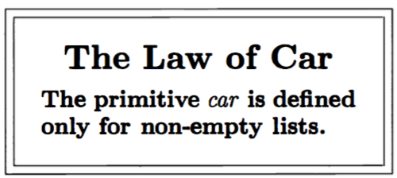
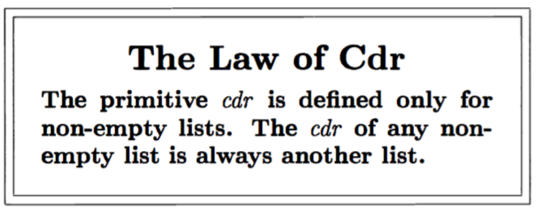
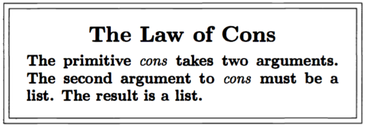
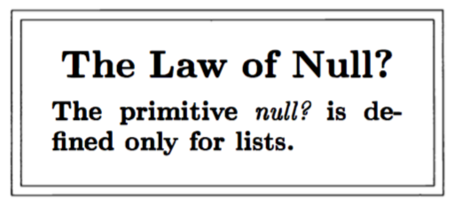
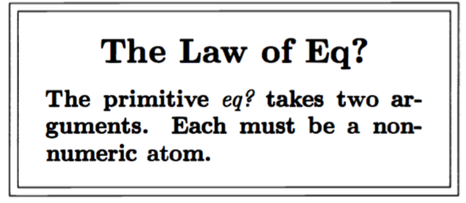

# Toys

```scheme
> (define atom? (lambda (x)
	(and (not (pair? x)) (not (null? x)))))
	
> (atom? (quote atom))
#t

> (atom? 45435)
#t

> (atom? (quote u))
#t

> (atom? (quote *e5te$))
#t

;; An atom enclosed by parentheses, is not an atom, it is a list
> (atom? (quote (atom)))
#f

> (atom? (quote (atom turkey or)))
#f

;; The following, are lists
> ((turkey atom) or)

;; All atoms and lists (even the nested) are S-expressions
;; A collection of S-expressions enclosed by parentheses is an
;; S-expression. The following expressions are lists

> (a b c d e)			;; 5 elements

> (a b (a f r))			;; 3 elements

> ()					;; A list (not an atom) with no elemnets

> (() () () ())			;; Also a list

;; The car of a list, is the first element of it, 
;; IF THE LIST IS NOT THE EMPTY LIST. The car of an atom
;; makes not sense

> (car (quote (a b c)))
a

> (car (quote ((a b c) d e)))
(a b c)

> (car (quote (((first) second) third four)))
((first) second)

> (car (car (quote (((first) second) third four))))
(first)
```



```scheme
;; (cdr lst), evaluates to the list lst, without the (car lst).
;; That makes sense when lst is a non-empty list. (cdr lst), just
;; is the same list as lst, without its car. The cdr of an atom
;; makes not sense at ll

> (cdr (quote (a b c)))
(b c)

> (cdr (quote ((a b c) x y z)))
(x y z)

> (cdr (quote ((unique))))
()

> (car (cdr (quote ((b) (x y) (c)))))
(x y)

> (cdr (cdr (quote ((b) (x y) (c)))))
((c))
```



```scheme
;; Read: "cons the atom a onto the list l."
> (cons 'peanut '(jelly butter))
(peanut jelly butter)

;; cons adds any S-exp ssion to the front of a list. IT MAKES NOT SENSE
;; TO CONS TWO ATOMS

> (cons '(a b) '(c d r t))
((a b) c d r t)

> (cons '((help) this) '(is very ((hard) to learn)))
(((help) this) is very ((hard) to learn))

> (cons 'a ())
(a)

> (cons '(a b c d) ())
((a b c d))

> (cons 'a (car '((b) c d)))
(a b)

> (cons 'a (car '((b) c d)))
(a c d)
```



```scheme
;; The unique null list, is (), so any expression that evaluates to (),
;; is the null list. null? takes as argument a list, not an atom

> (null? '())
#t

> (null? '(a b c))
#f

```



```scheme
;; eq?, takes as arguments two non-numeric atoms, and tells if both are equal

> (eq? 'Harry 'Harry)
#t

> (eq? 'Margarine 'Butter)
#f

> (eq? (car '(a b c d)) 'a)
#t

> (eq? (car '(bean bean meat cheese)) (car (cdr '(bean bean meat cheese))))
#t
```


