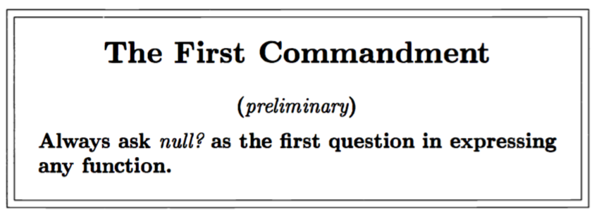

# Do it, do it again, and again, and again...

```scheme
(define atom? (lambda (x)
	(and 
		(not (pair? x)) 
		(not (null? x)))
))

;; lat? looks at each S-expression in a list, in turn, and asks 
;; if each S-expression is an atom, until it runs out of S-expressions. 
;; If it runs out without encountering a list, the value is #t. 
;; If it  nds a list, the value is #f-false 

(define lat? 
	(lambda (l) 
		(cond
			((null? l) #t)
			((atom? (car l)) 
				(lat? (cdr l)))
			(else #f)
)))

> (lat? '(a b c d))
#t

> (lat? '((a b c) d e f))
#f

> (lat? '(a b (c d e) f))
#f

;; Is true, since () does not contain a list
> (lat? ())
#t

(define member?
	(lambda (x xs)
		(cond
			((null? xs) #f)
			(else 
				(or (eq? (car xs) x) 
				(member? x (cdr xs))))
)))

> (member? 'a '(a b c d e))
#t

> (member? 'z '(a b c d e))
#f

> (member? 'e '(a b c d e))
#t
```

