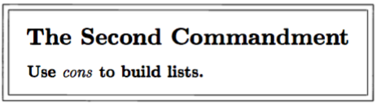
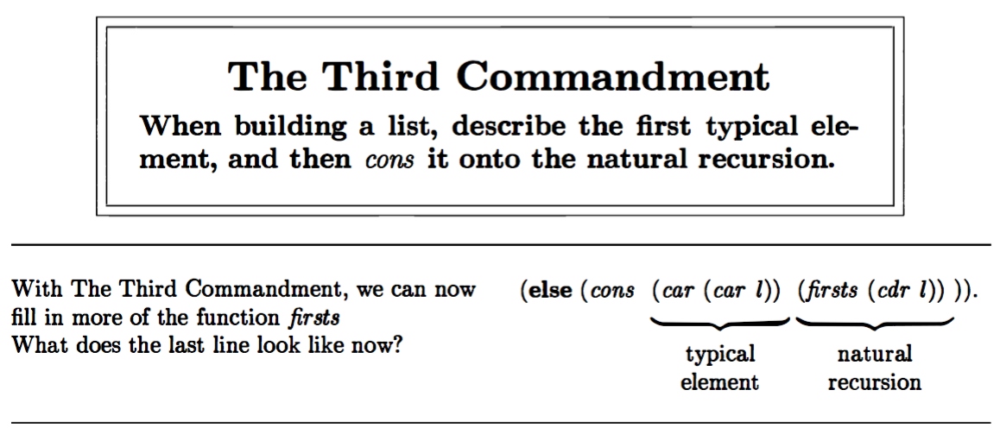

# Do it, do it again, and again, and again...

```scheme
;; rember, takes an atom an a list as its arguments, and makes, a new list
;; with the first occurrence of the atom in the old list removed

(define buggy-rember
	(lambda (x xs)
		(cond
			((null? xs) '())
			(else (cond
					((eq? x (car xs)) 
						(cdr xs))
					(else (buggy-rember x 
						(cdr xs)))
)))))

> (buggy-rember 'a '(b a c d a))
(c d a)
```



```scheme
(define rember
	(lambda (x xs)
		(cond 
			((null? xs) '())
			(else 
				(cond
					((eq? (car xs) x) (cdr xs))
					(else (cons (car xs)
						(rember x (cdr xs))))
)))))

> (rember 'a '(b j u h a c d a))
(b j u h c d a)

;; The function forst, takes one argument, a list, which is either null, 
;; or contains only non-empty lists. It builds another list, composed of
;; the first S-expression of each nested list

(define first
	(lambda (xs)
		(cond 
			((null? xs) '())
			(else
				(cons 
					(car (car xs)) 
					(first (cdr xs))))
)))
					
> (first '((five plum) (de e w w) (i h h k k))
(five de i)
```



```scheme
;; The function insertR, takes three arguments, a list xs and two 
;; atoms old and new. It then builds another list with new inserted
;; to the right of the first occurrence of the atom old in the list

;; (insertR 'topping 'fudge '(ice cream with fudge for dessert))
;; ~ '(ice cream with fudge topping for dessert)

;; (insertR 'jalapeño 'and '(tacos tamales and salsa))
;; ~ '(tacos tamales and jalapeño salsa)

;; (insertR 'e 'd '(a b c d f g h))
;; ~ '(a b c d e f g)

(define insertR
	(lambda (new old xs)
		(cond 
			((null? xs) '())
			(else
				(cond
					((eq? (car xs) old) 
						(cons 
							old 
							(cons new (cdr xs))))
					(else 
						(cons 
							(car xs) 
							(insertR new old (cdr xs))))))
)))

;; insertL does what is expected

(define insertL
	(lambda (new old xs)
		(cond 
			((null? xs) '())
			(else
				(cond 
					((eq? (car xs) old)
						(cons 
							new 
							(cons old (cdr xs)))
					(else
						(cons 
							(car xs) 
							(insertL new old (cdr xs)))))))
)))
```

```scheme
;; The function replace, replaces the first occurrence of an atom, for another

(define replace
	(lambda (new old xs)
		(cond 
			((null? xs) '())
			((eq? (car xs) old) (cons new (cdr xs)))
			(else (cons (car xs) (replace new old (cdr xs))))
)))

> (replace 'd 'z '(a b c z e f))
(a b c d e f)

;; The function replace2. replaces either the first occurrence of o1 or the 
;; first occurrence of o2 by new:

> (replace2 'vanilla 'chocolate 'banana 
 	'(banana ice cream with chocolate topping))
(vanilla ice cream with chocolate topping)

(define replace2
	(lambda (new old1 old2 xs)
		(cond 
			((null? xs) '())
			((or 
				(eq? old1 (car xs)) 
				(eq? old2 (car xs))) 
					(cons new (cdr xs)))
			(else 
				(cons 
					(car xs) 
					(replace2 
						new old1 old2 
						(cdr xs))))
)))

;; The function multirember, removes every occurrence of x from xs

(define multirember
	(lambda (x xs)
		(cond
			((null? xs) '())
			((eq? (car xs) x)
				(multirember x (cdr xs)))
			(else
				(cons 
					(car xs) 
					(multirember x (cdr xs))))
)))

> (multirember 'a '(a b c a a d a f g a))
(b c d f g)
```